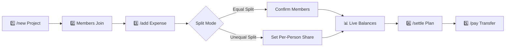

<div align="center">

# 💸 Dong Bot (دانگ‌بات)
### Smart Group Expense Sharing & Debt Settlement on Telegram

[](https://t.me/DongShareBot)
[](https://workers.cloudflare.com/)
[](https://developers.cloudflare.com/d1/)
[](https://grammy.dev/)
[](https://www.typescriptlang.org/)
[](https://github.com/mohasara/Dong-Telegram-Bot/actions)
[](https://opensource.org/licenses/ISC)

<br/>

**Dong Bot** is a high-performance, serverless Telegram bot engineered to make splitting bills, tracking shared trip expenses, and settling group debts completely effortless. Built for trips, roommates, parties, dinners, and group events.

<br/>

<a href="https://t.me/DongShareBot"></a>
&nbsp;&nbsp;
<a href="https://t.me/DongShareBot?startgroup=true"></a>

</div>

---

## 🌟 Why Dong Bot?

Managing shared finances in groups is usually messy: spreadsheets, confusing calculator apps, or endless messaging about who owes whom. **Dong Bot lives right inside your Telegram chat** and automates everything in real-time.

```text
       [ Group Trip / Dinner ]
                  │
                  ▼
         /new Trip to Caspian
                  │
          ┌───────┴───────┐
          ▼               ▼
     Member A        Member B
   Logs: $120      Logs: $45
          │               │
          └───────┬───────┘
                  ▼
         /settle Algorithm
                  │
                  ▼
  "Member B pays Member A: $37.50"
 (1 payment settles the whole group!)
```

### ✨ Key Capabilities

- ⚡ **Global Sub-100ms Speed**: Hosted on **Cloudflare Workers** edge network running across 300+ cities worldwide with zero cold-starts.
- 🧮 **Inline Math Evaluator**: Supports complex math expressions on the fly! Type `/add 25000+14000/2 Taxi` or `/pay 100000*0.5`.
- 🍕 **Equal & Unequal Splitting**:
  - **Equal Split**: 1-tap participant toggle with instant equal division.
  - **Unequal / Itemized Split**: Step-by-step per-member share input, remaining amount countdown, or unknown total calculation.
- ⚖️ **Optimal Debt Settlement**: Proprietary debt simplification algorithm calculates the minimum number of transactions needed to completely balance all members.
- 🇮🇷 **RTL & Persian / Arabic Safe**: Native Left-to-Right Marker (`\u200E`) isolation ensures Persian names, numbers, arrows, and debt directions never get flipped or scrambled.
- 🧹 **Zero Group Clutter**: Ephemeral wizards and interactive messages automatically delete themselves once you confirm, keeping group history clean.
- 📱 **Private Chat Dashboard**: Check your net balances, debts, and projects across all your groups from the bot's private chat via an interactive 2×2 menu.
- 🧾 **Interactive Transaction History**: Browse, inspect itemized member shares, or delete individual expenses and payments with 2-step confirmation.

---

## 🚀 How It Works



### 1. Create a Project
Start a project in any group chat with an optional currency symbol or code:
```text
/new Trip to Caspian $
/new House Expenses Toman
```
Group members simply tap **[✋ Join Project]** or you can reply with a name to add offline friends!

### 2. Record Expenses (Supports Math!)
Log an expense directly in one command or follow the interactive step-by-step wizard:
```text
/add 50000 Dinner
/add 12000+8500 Taxi
/add 150/3 Coffee
```
Choose whether to split **equally** (toggle participants with checkboxes) or **unequally** (assign exact amounts to each member).

### 3. Check Who Owes Whom
View live member balances and actionable debts at any time:
```text
/balances   -> Member balances & detailed spending breakdown
/settle     -> The optimal settlement plan (who pays whom)
```

### 4. Record Payments
When a debt is settled, log it to update everyone's balances:
```text
/pay 25000
```
*(Select sender and receiver with interactive buttons; balances update automatically!)*

### 5. Review & Manage
Browse past transactions or view group reports:
```text
/transaction -> Browse, view itemized shares, or delete transactions
/projects    -> View full spending reports, close, or delete projects
```

---

## 📖 Command Reference

| Command | Arguments | Description | Example |
|:---|:---|:---|:---|
| `/new` | `<Name> [Currency]` | Create a new project in the group | `/new North Trip $` |
| `/add` | `[amount] [description]` | Record an expense (supports math) | `/add 45000+5000 Dinner` |
| `/pay` | `[amount]` | Record a direct transfer between members | `/pay 25000` |
| `/transaction` | — | Browse paginated transactions, view shares & delete | `/transaction` |
| `/balances` | — | View member balances, total spent & breakdown | `/balances` |
| `/settle` | — | Get the optimal debt settlement plan | `/settle` |
| `/projects` | — | View project reports, close, or delete projects | `/projects` |
| `/help` | — | Show the complete guide and command list | `/help` |

> 💡 **Tip:** In **Private Chat** ([@DongShareBot](https://t.me/DongShareBot)), you have a persistent on-screen menu with **👤 My Balances**, **📁 My Projects**, **🧾 Transactions**, and **❓ Help & Guide**!

---

## 🛠️ Architecture & Tech Stack

```text
                     ┌─────────────────────────────┐
                     │    Telegram Bot Platform    │
                     └──────────────┬──────────────┘
                                    │ Webhook (HTTPS)
                                    ▼
                     ┌─────────────────────────────┐
                     │  Cloudflare Workers (Edge)  │
                     │   • TypeScript + grammY     │
                     │   • Minimal Debt Algorithm  │
                     │   • Safe Math Evaluator     │
                     └──────────────┬──────────────┘
                                    │
                                    ▼
                     ┌─────────────────────────────┐
                     │  Cloudflare D1 (Serverless) │
                     │   • Projects & Members      │
                     │   • Expenses & Splits       │
                     │   • Settlements & Drafts    │
                     └─────────────────────────────┘
```

- **Runtime**: [Cloudflare Workers](https://workers.cloudflare.com/) (V8 isolates at the edge)
- **Framework**: [grammY](https://grammy.dev/) (Modern TypeScript Telegram Bot framework)
- **Database**: [Cloudflare D1](https://developers.cloudflare.com/d1/) (Serverless distributed SQLite)
- **CI/CD**: GitHub Actions automated pipeline with automatic command menu sync
- **Security**: Webhook-based stateless architecture, parameterized SQL queries preventing SQL injections

---

## 💻 Self-Hosting & Deployment

Want to host your own instance of Dong Bot? Follow these steps:

### Prerequisites
- [Node.js](https://nodejs.org/) v20 or newer
- A [Cloudflare](https://dash.cloudflare.com/) account
- A Telegram Bot Token from [@BotFather](https://t.me/BotFather)

### 1. Clone the Repository
```bash
git clone https://github.com/mohasara/Dong-Telegram-Bot.git
cd Dong-Telegram-Bot
npm install
```

### 2. Create the Cloudflare D1 Database
```bash
npx wrangler d1 create dong_db
```
Copy the generated `database_id` into your `wrangler.jsonc` file:
```jsonc
{
  "d1_databases": [
    {
      "binding": "DB",
      "database_name": "dong_db",
      "database_id": "YOUR_DATABASE_ID_HERE"
    }
  ]
}
```

### 3. Initialize the Database Schema
Execute the SQL schema on your remote D1 database:
```bash
npx wrangler d1 execute dong_db --remote --file=./schema.sql
```

### 4. Configure Cloudflare Secrets
Set your Telegram bot token:
```bash
npx wrangler secret put BOT_TOKEN
```

### 5. Deploy to Cloudflare Workers
```bash
npm run deploy
```

### 6. Register Webhook & Telegram Commands
Set your bot's webhook:
```bash
curl -F "url=https://<your-worker-subdomain>.workers.dev" https://api.telegram.org/bot<YOUR_BOT_TOKEN>/setWebhook
```
Register the bot commands menu:
```bash
curl https://<your-worker-subdomain>.workers.dev/setcommands
```

---

## 🤝 Contributing

Contributions, feature requests, and bug reports are welcome!
Feel free to open an issue or submit a Pull Request:

1. Fork the Project
2. Create your Feature Branch (`git checkout -b feature/AmazingFeature`)
3. Commit your Changes (`git commit -m 'Add some AmazingFeature'`)
4. Push to the Branch (`git push origin feature/AmazingFeature`)
5. Open a Pull Request

---

## 📄 License

This project is licensed under the **ISC License**.

<div align="center">
  <sub>Built with ❤️ for hassle-free group expenses. Powered by Cloudflare Workers & grammY.</sub>
</div>
